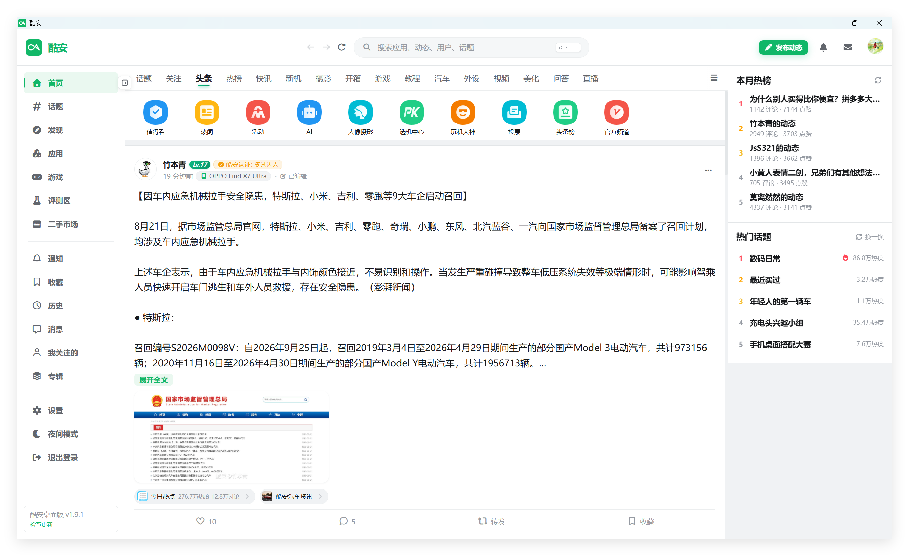
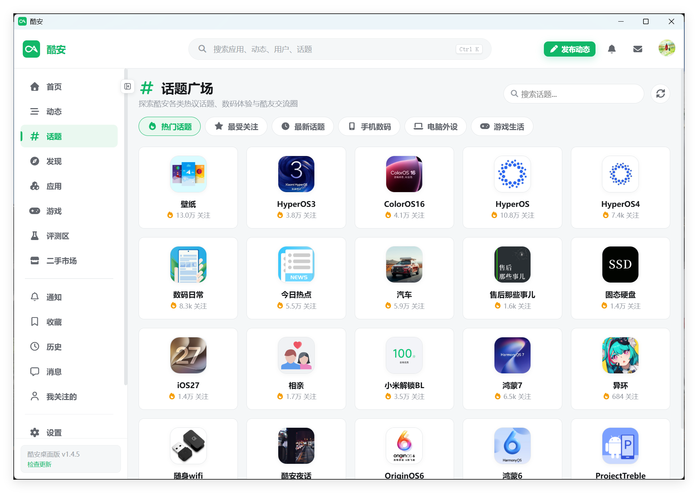
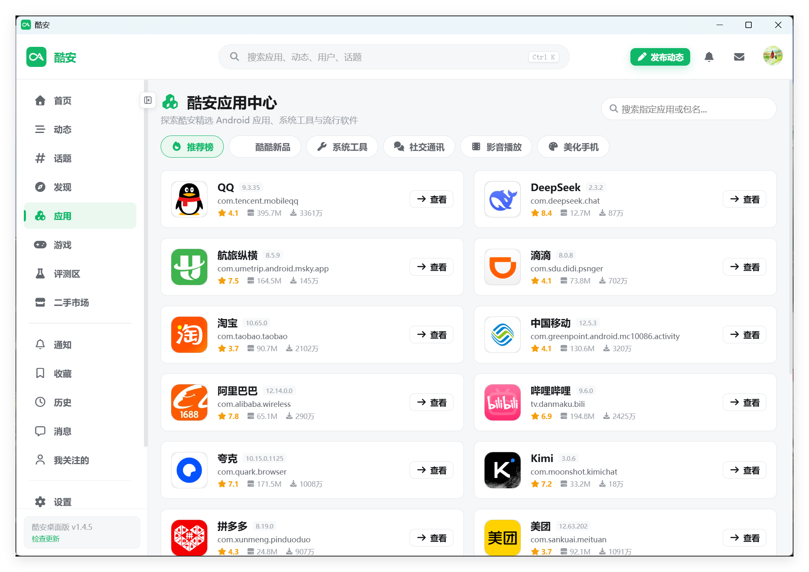
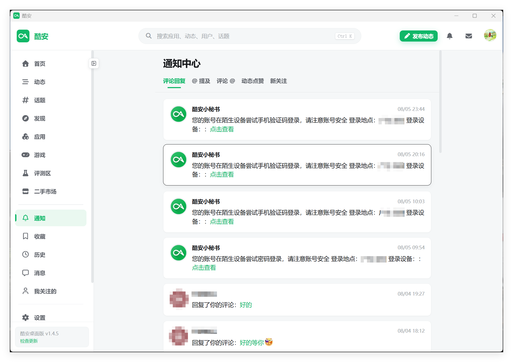
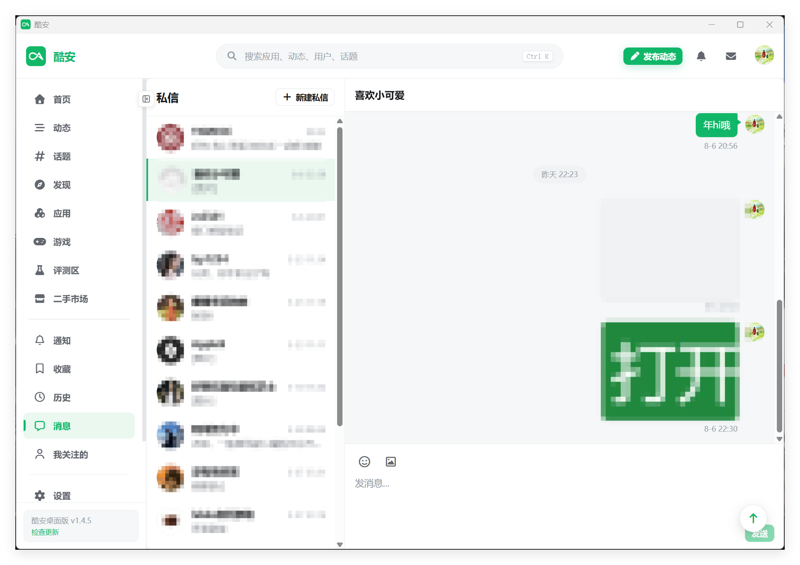
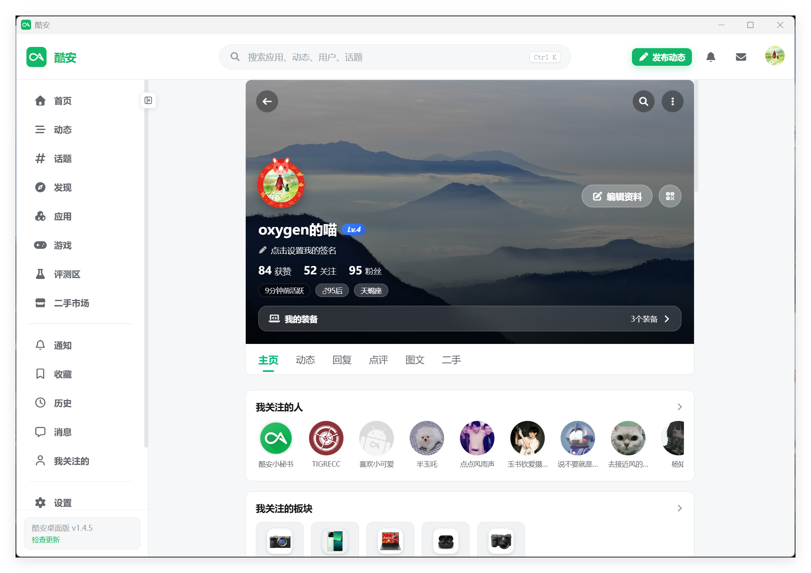
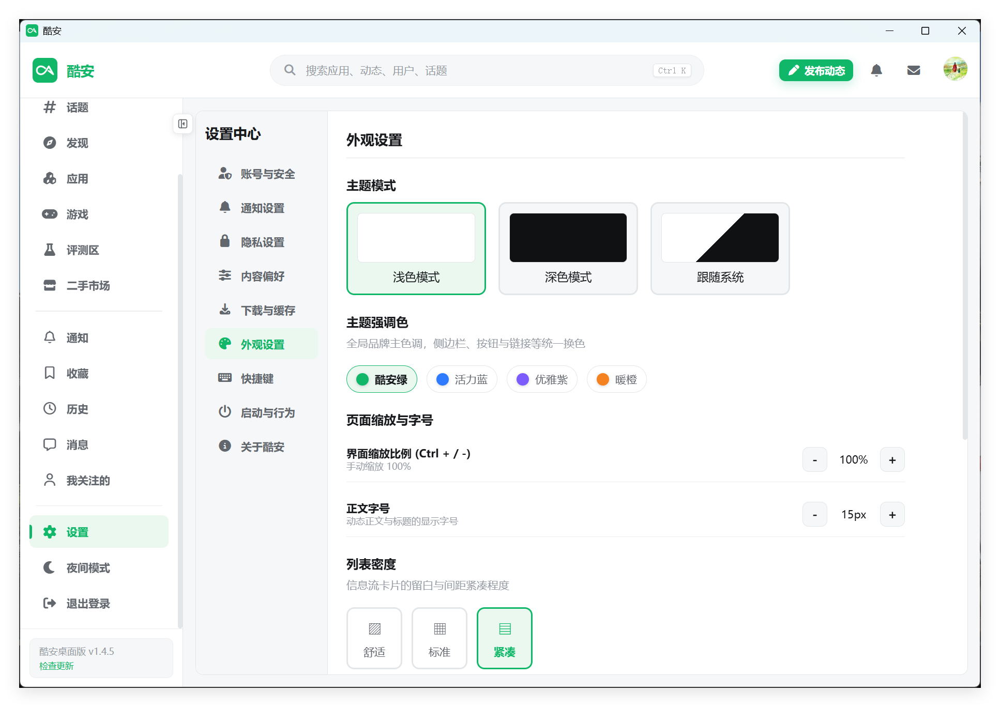

<p align="center">
  
</p>

<h1 align="center">酷安</h1>

<p align="center">基于 Tauri 2、Vue 3 和 Rust 的非官方酷安桌面客户端。</p>

<p align="center">
  <a href="https://github.com/daimiaopeng/coolapk-desktop/actions/workflows/build.yml"></a>
  <a href="https://github.com/daimiaopeng/coolapk-desktop/releases"></a>
  <a href="LICENSE"></a>
  
</p>

> [!IMPORTANT]
> 本项目是社区维护的非官方客户端，与酷安官方及深圳酷安网络科技有限公司无隶属、授权或合作关系。酷安名称、Logo 和相关商标归其权利人所有。

## 📥 下载与安装

请前往 [👉 GitHub Releases](https://github.com/daimiaopeng/coolapk-desktop/releases) 获取各平台的最新版本程序包：

| 操作系统 | 文件格式 | 推荐安装包 |
| :--- | :--- | :--- |
| **Windows 安装版** | `.exe` | `coolapk-desktop_x.x.x_x64-setup.exe` (x64) / `arm64-setup.exe` (ARM64) |
| **Windows 单文件版** | `.exe` | `coolapk-desktop_x.x.x_x64-portable.exe` (x64) / `arm64-portable.exe` (ARM64) |
| **macOS** | `.dmg` / `.app` | `coolapk-desktop_x.x.x_aarch64.dmg` (Apple 芯片) / `x64.dmg` (Intel 芯片) |
| **Linux** | `.AppImage` / `.deb` / `.rpm` | `coolapk-desktop_x.x.x_amd64.AppImage` / `.deb` / `.rpm` |
| **Android** | `.apk` / `.aab` | `coolapk-vx.y.z-android-arm64.apk` / `coolapk-vx.y.z-android-arm64.aab` |
| **iPhone / iPad** | `.ipa` | `coolapk-vx.y.z-ios-arm64-unsigned.ipa`（未签名，需自行签名安装） |

> 💡 **提示**：构建产物均由 GitHub Actions 自动化流程在云端打包。Windows 单文件版无需解压或安装，系统需已有 WebView2 Runtime。iOS IPA 为未签名设备包，不能直接安装到普通 iPhone/iPad，需要使用 AltStore、SideStore、Sideloadly 或自己的 Apple 证书完成签名。

## 界面预览
















## 功能

- **首页信息流**：推荐、热榜、快讯、酷图、二手、数码、评测等频道一应俱全
- **动态浏览**：图文详情、评论楼中楼、热门爆评、点赞、收藏、转发查看，体验顺畅
- **浏览历史**：时间轴轨迹记录，支持动态、用户、话题与应用分类即时筛选及右侧常逛侧边栏
- **关注与粉丝**：双列响应式布局，支持查看已关注酷友及粉丝列表、实时动态与全量自动翻页
- **搜索直达**：全站综合搜索涵盖应用、游戏、用户、话题与动态帖子
- **收藏管理**：集成云端收藏与收藏单合集，支持全屏满幅平铺浏览
- **广场中心**：涵盖话题广场、评测区、应用中心与游戏中心
- **私信聊天**：支持文字与图片消息，支持多账号快速切换
- **账号能力**：官方授权或 Cookie 登录（详见 [手动抓取与导入 Cookie 指南](docs/cookie-guide.md)），多账户本地保存与一键切账号
- **个性化与布局**：全屏无边距满幅平铺、深浅色主题、侧边栏折叠与默认启动页设置
- **跨平台**：Windows、macOS、Linux 原生桌面应用，以及 Android、iOS 移动端应用

部分功能依赖酷安服务端接口，可能因官方调整、账号权限或风控策略而临时失效。

## 隐私与网络访问

- 项目不内置个人 Cookie、账号 Token、统计 SDK 或遥测服务。
- 登录凭据由用户手动输入，只保存在本地应用数据目录的账户库中，不写入仓库。
- 客户端标识在每次启动时临时生成，不使用开发者或用户的固定设备指纹。
- 应用会直接访问 `api.coolapk.com`、酷安图片/静态资源域名；不会向第三方字体或图标 CDN 发起请求。
- 请勿在 Issue、日志或截图中提交真实 Cookie、私信和其他个人数据。

详见 [SECURITY.md](SECURITY.md)。

## 开发环境

- Node.js 22 或更高版本
- Rust stable
- 各平台的 [Tauri 2 系统依赖](https://v2.tauri.app/start/prerequisites/)

```bash
git clone https://github.com/daimiaopeng/coolapk-desktop.git
cd coolapk-desktop
npm ci
npm run tauri dev
```

生产构建可按当前平台选择产物格式：

```bash
# Windows：构建 NSIS 安装包；原始 release 可执行文件即单文件版
npm run tauri build -- --bundles nsis
./scripts/prepare-windows-portable.ps1 -Architecture x64

# Linux
npm run tauri build -- --bundles appimage,deb,rpm

# macOS
npm run tauri build -- --bundles app,dmg
```

### Android APK

Android 构建需要 JDK 17+、Android SDK、Platform Tools、Build Tools 和 NDK (Side by side)。Windows 下构建脚本会自动读取 `JAVA_HOME`、`ANDROID_HOME`、`NDK_HOME`，也能识别默认 Android SDK 和本项目使用的 Android OpenJDK 安装位置。

```bash
# 首次生成 Android 工程（生成目录不会提交到 Git）
npm run android:init

# 默认构建 ARM64 debug APK，适用于大多数真机
npm run android:build

# 自定义目标，例如生成全部架构的 debug APK
npm run android:build -- --debug --apk
```

APK 输出到 `src-tauri/gen/android/app/build/outputs/apk/`。连接设备后可用 `adb install -r <apk路径>` 安装。正式分发前还需配置 Android 签名；Google Play 应优先构建并上传 AAB。

Tag 发布时，GitHub Actions 会构建签名的 ARM64 release APK 和 AAB，并上传到同一个 GitHub Release。仓库需要配置以下 Actions Secrets：

- `ANDROID_KEYSTORE_BASE64`：上传密钥 `.jks` 文件的 Base64 内容
- `ANDROID_KEYSTORE_PASSWORD`：密钥库密码
- `ANDROID_KEY_ALIAS`：密钥别名
- `ANDROID_KEY_PASSWORD`：密钥密码

安装包位于 `src-tauri/target/release/bundle/`。GitHub Actions 会提供：

- Windows x64：NSIS 安装包 `-setup.exe`、单文件便携版 `x64-portable.exe`
- Windows ARM64：NSIS 安装包 `-setup.exe`、单文件便携版 `arm64-portable.exe`
- Linux x64：AppImage 免安装版 `.AppImage`、Debian 安装包 `.deb`、RPM 安装包 `.rpm`
- macOS Apple 芯片：磁盘映像 `.dmg`、应用包 `.app`
- macOS Intel：磁盘映像 `.dmg`、应用包 `.app`
- Android ARM64：Release APK `.apk`、Google Play 发布包 `.aab`
- iOS ARM64：未签名 IPA `.ipa`（供第三方工具或用户自行签名）

### iOS IPA

iOS 构建必须在 macOS 上完成，并需要完整的 Xcode、CocoaPods 和 Rust iOS 目标。首次构建前，在 macOS 上执行：

```bash
# 安装 CocoaPods（已安装可跳过）
brew install cocoapods

# 安装 Rust iOS 目标
rustup target add aarch64-apple-ios aarch64-apple-ios-sim x86_64-apple-ios

# 首次生成 iOS 工程
npm run tauri -- ios init

# 使用 Xcode 打开并调试
npm run tauri -- ios dev --open

# 构建设备版未签名 IPA
npm run tauri -- ios build --target aarch64 --no-sign --ci
```

GitHub Actions 会在推送 `v*` 版本标签时自动生成 ARM64 未签名 IPA，并上传到对应的 GitHub Release。该 IPA 不包含 Apple 开发者签名，安装到真机前需要使用 AltStore、SideStore、Sideloadly 或自己的证书重新签名；它不是可直接提交 App Store 的发行包。

## 自动发布

推送以 `v` 开头的版本标签后，GitHub Actions 会自动构建全部平台，并创建公开的 GitHub Release，上传上述安装包。普通的 `main` 分支推送和 Pull Request 只执行构建检查，不会发布版本。

发布前只需更新 `src/constants/version.ts` 并创建对应标签，GitHub Actions 会从标签自动同步版本号到全部构建文件：

```bash
npm run version:set -- 1.2.3
npm run build
git tag v1.2.3
git push origin main v1.2.3
```

Windows 客户端会自动识别当前运行方式：安装版下载同架构的 `-setup.exe` 静默升级，单文件版下载同架构的 `-portable.exe`，退出后原位替换并重启。两种更新包都必须与 Release 标签版本一致，避免装错版本。

## 常用检查

```bash
npm run build
npm audit
cd src-tauri
cargo test
cargo check
```

## 项目结构

```text
src/                         Vue 3 / TypeScript 前端
  api/coolapk.ts             Tauri 命令调用封装
  utils/coolapkEmoji.ts      酷安表情映射
src-tauri/                   Rust / Tauri 桌面端
  src/coolapk/auth.rs        Token V3 兼容签名
  src/coolapk/client.rs      API、图片和会话请求
  src/coolapk/commands.rs    Tauri commands
  src/coolapk/api_tests.rs   接口可用性探测测试
docs/screenshots/            界面预览截图
.github/workflows/build.yml  跨平台构建流程
```

## 登录说明

公开浏览功能（查看动态、评论、图文等）无需登录即可使用。若需发帖、评论、点赞、私信等互动操作，可在客户端右上角唤起登录弹窗：

1. **官方授权登录（推荐）**：
   - 客户端内置调起酷安官方授权登录页面（`account.coolapk.com`），支持微信扫码与手机短信验证码登录，登录成功后自动同步会话与多账号库。
2. **手动 Cookie 导入（备用）**：
   - 若系统未安装完整 WebView2 或官方窗口授权异常，可展开弹窗底部的「备用登录选项」，通过浏览器抓取 Cookie 凭据进行导入。
   - 详细提取与配置步骤请参阅：👉 **[📖 手动抓取与导入 Cookie 指南](docs/cookie-guide.md)**（包含保留日志、定位主站请求与凭据有效性校验步骤）。

> ⚠️ **凭据安全提示**：Cookie 包含账号的完整操作权限。客户端仅将其安全持久化在本地应用数据目录中，绝不写入代码仓库或上传任何第三方服务器。请妥善保管，切勿在公开 Issue、日志或聊天截图中泄露真实 Cookie。

## 贡献

欢迎提交 Issue 和 Pull Request。提交前请运行前端构建、Rust 测试，并确保测试数据不包含真实账号、Cookie、设备标识或私信内容。

## 许可证

代码采用 [MIT 许可证](LICENSE)。第三方品牌、Logo、表情及服务端内容不包含在 MIT 授权范围内，详见 [第三方声明](NOTICE.md)。
