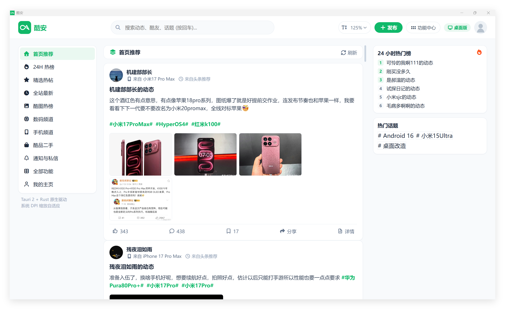
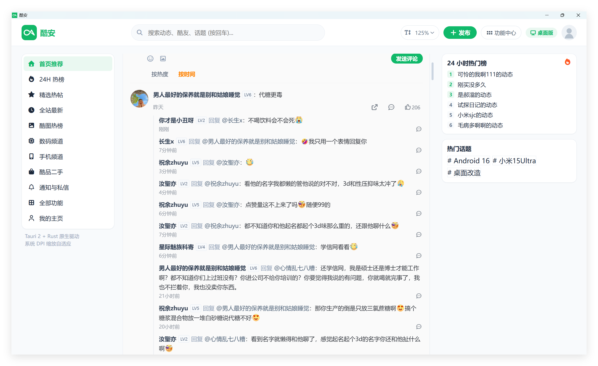

<p align="center">
  
</p>

<h1 align="center">酷安</h1>

<p align="center">基于 Tauri 2、Vue 3 和 Rust 的非官方酷安桌面客户端。</p>

<p align="center">
  <a href="https://github.com/daimiaopeng/coolapk-desktop/actions/workflows/build.yml"></a>
  <a href="LICENSE"></a>
  
</p>

> [!IMPORTANT]
> 本项目是社区维护的非官方客户端，与酷安官方及深圳酷安网络科技有限公司无隶属、授权或合作关系。酷安名称、Logo 和相关商标归其权利人所有。

## 界面预览

### 动态首页



### 评论区



## 功能

- 首页推荐、24 小时热榜、精选、最新、酷图、二手和分类频道
- 正文超过约 12 行时才折叠，点击后在本地即时展开，不额外请求详情接口
- 首屏动态详情和评论在列表显示后以有限并发后台预加载，打开时优先使用缓存
- 微博风格评论区、楼中楼、热门/时间排序及酷安表情
- 搜索、用户空间、话题、应用详情、通知和私信接口
- 点赞、评论、关注、发布等登录后操作
- Rust 原生网络层、Token V3 兼容签名及图片代理
- Windows、macOS、Linux 原生桌面构建

接口来自未公开、可能随时变化的移动端协议。部分频道或登录后操作可能因服务端调整、账号权限或风控策略失效。

## 隐私与网络访问

- 项目不内置个人 Cookie、账号 Token、统计 SDK或遥测服务。
- 登录 Cookie 由用户手动输入，只保存在当前进程内存中，退出应用后失效。
- 客户端标识在每次启动时临时生成，不使用开发者或用户的固定设备指纹。
- 应用会直接访问 `api.coolapk.com`、酷安图片/静态资源域名；不会向第三方字体或图标 CDN 发起请求。
- 请勿在 Issue、日志或截图中提交真实 Cookie、私信和其他个人数据。

详见 [SECURITY.md](SECURITY.md)。

## 开发环境

- Node.js 22 或更高版本
- Rust stable
- 各平台的 [Tauri 2 系统依赖](https://v2.tauri.app/start/prerequisites/)

```bash
git clone https://github.com/daimiaopeng/coolapk-desktop.git
cd coolapk-desktop
npm ci
npm run tauri dev
```

生产构建可按当前平台选择产物格式：

```bash
# Windows：仅构建 NSIS 安装包
npm run tauri build -- --bundles nsis

# Linux
npm run tauri build -- --bundles appimage,deb,rpm

# macOS
npm run tauri build -- --bundles app,dmg
```

安装包位于 `src-tauri/target/release/bundle/`。GitHub Actions 会提供：

- Windows x64：仅提供 NSIS 安装包 `-setup.exe`，不上传便携版或 MSI
- Linux x64：AppImage 免安装版 `.AppImage`、Debian 安装包 `.deb`、RPM 安装包 `.rpm`
- macOS Apple 芯片：磁盘映像 `.dmg`、应用包 `.app`
- macOS Intel：磁盘映像 `.dmg`、应用包 `.app`

## 自动发布

推送以 `v` 开头的版本标签后，GitHub Actions 会自动构建全部平台，并创建公开的 GitHub Release，上传上述安装包。普通的 `main` 分支推送和 Pull Request 只执行构建检查，不会发布版本。

发布前请先更新 `src-tauri/tauri.conf.json` 中的版本号，再创建并推送对应标签，例如：

```bash
git tag v1.2
git push origin v1.2
```

## 常用检查

```bash
npm run build
npm audit
cd src-tauri
cargo test
cargo check
```

## 项目结构

```text
src/                         Vue 3 / TypeScript 前端
  api/coolapk.ts             Tauri 命令调用封装
  utils/coolapkEmoji.ts      酷安表情映射
src-tauri/                   Rust / Tauri 桌面端
  src/coolapk/auth.rs        Token V3 兼容签名
  src/coolapk/client.rs      API、图片和会话请求
  src/coolapk/commands.rs    Tauri commands
.github/workflows/build.yml  跨平台构建流程
```

## 登录说明

公开浏览功能不需要登录。需要账号权限的操作可在“功能中心”临时载入 Cookie。Cookie 不会写入仓库或持久化到磁盘，但它仍等同于账号凭据，请只在可信的本地构建中使用。

## 贡献

欢迎提交 Issue 和 Pull Request。提交前请运行前端构建、Rust 测试，并确保测试数据不包含真实账号、Cookie、设备标识或私信内容。

## 许可证

代码采用 [MIT 许可证](LICENSE)。第三方品牌、Logo、表情及服务端内容不包含在 MIT 授权范围内，详见 [第三方声明](NOTICE.md)。
